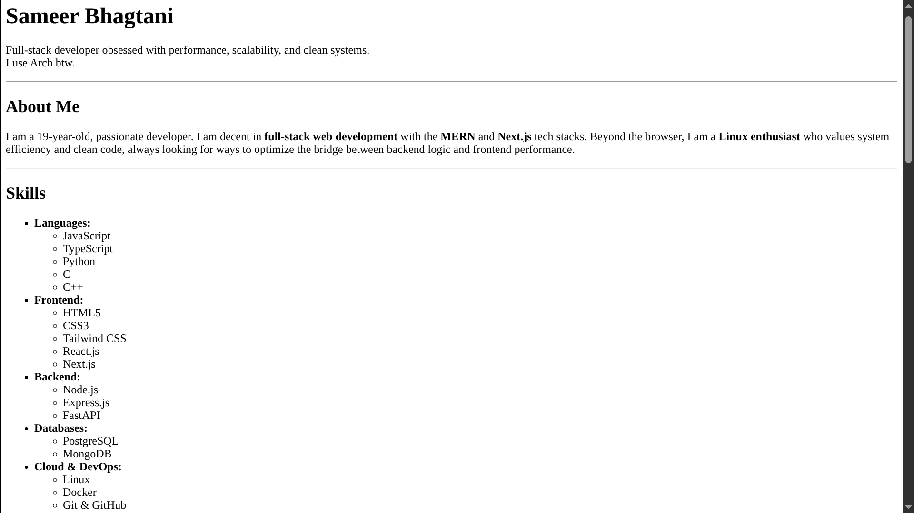
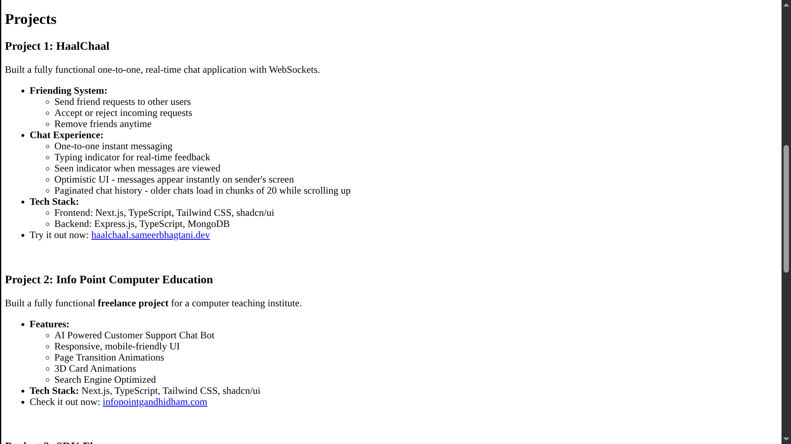
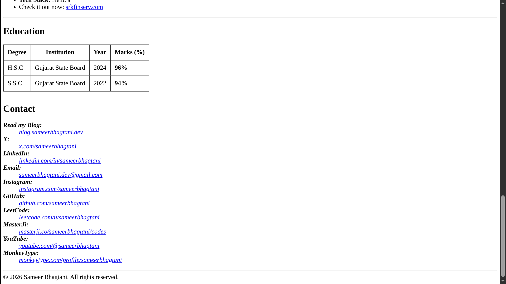

# HTML Resume

## Project Overview

This repository contains a strictly semantic HTML5 resume. It was developed as a peer assignment for the ChaiCode Web Development Cohort 2026.

## Accessing the Project

Check out the live version of this website at: https://sameerbhagtani.github.io/html-resume-cohort/

To clone the repository locally, execute the following command:

```bash
git clone https://github.com/sameerbhagtani/html-resume-cohort
```

## Technical Features

- **Semantic Architecture:** Strategic implementation of `<header>`, `<main>`, `<section>`, `<article>`, and `<footer>` to define a clear document content model.
- **Accessible Tabular Data:** Implementation of the `scope` attribute within table headers for screen-reader compatibility and the `<time>` element for machine-readable dates.
- **Metadata Optimization:** Inclusion of a descriptive meta tag for SEO and a favicon link for browser-level recognition.

- **Structural Hierarchy:** Precise management of heading levels (`h1` through `h3`) and horizontal rules (`hr`) to ensure logical content flow and visual clarity.

## Screenshots






